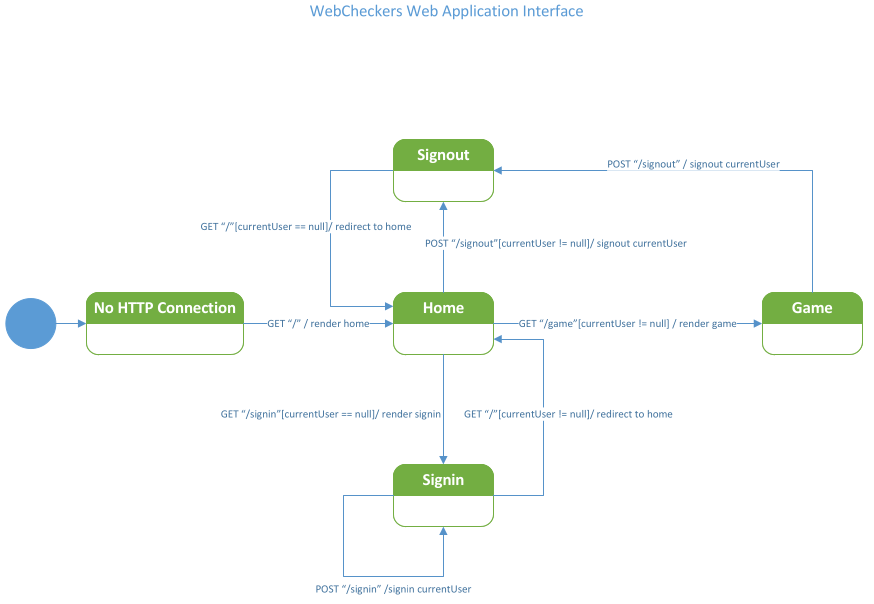

# PROJECT Design Documentation

## Team Information

* Team name: Team 3
* Team members
  * James McGrath
  * Daniel Carter
  * Cameron Miele
  * Connor Witkiewicz
  * Chen Lin

## Executive Summary

WebCheckers is a web based application that uses a Spark web micro framework and FreeMarker template engine
to create a checkers game for players to sign-in and play. The application is built in Java 8=> 11.

### Purpose

To allow players a chance to play a game of online checkers against other opponents.

### Glossary and Acronyms

| Term | Definition |
|------|------------|
| VO | Value Object |
| UI | User Interface |
| MVP | Minimum Viable Product |

## Requirements

This section describes the features of the application.

### Definition of MVP

The MVP of WebCheckers is a player must have the ability to sign in, start a game, move their pieces, jump an opponents 
piece, double jump an opponents pieces, resign from a game, sign out, sign in as a spectator, watch a game in progress, 
re-watch previous played games.

### MVP Features

* As a Player I want to sign-in so that I can play a game of checkers.
* As a Player I want to start a game so that I can play checkers with an opponent.
* As a Player I want to move my pieces so that I strategically place my pieces on the checkerboard and take my opponents
pieces.
* As a Player I want to resign anytime I want to so that I can stop playing.
* As a Player I want to sign-out so that that someone else can sign-in.
* As a Player I want to be in spectator mode so that I can watch other players play.

### Roadmap of Enhancements

* Sign in
* Start game
* Player Movement
* Resign from game
* Sign out
* Player turn
* Kinging
* Winning or Losing
* Replay mode
* Spectator mode

## Application Domain

This section describes the application domain.

* Player- A user who has the ability to play a game of checkers.
* Board- An 8x8 checkerboard the player interacts with during a game.
* Square- One space on the board a player can move their piece to.
* Move- A player transferring their piece from one square to another.
* Move Backwards- A movement that only a 'King' can do.
* King- A piece that has traversed the board and is given the ability to move backwards.
* Piece- A players movable object on the board.
* Sign In- An action that the player does to have access to start a game.
* Sign Out- An acton that the player does to leave the lobby list.
* Quit- An action the player does to resign from a game.
* Checkers- The game all players play.

## Architecture and Design

This section describes the application architecture.

### Summary

The following Tiers/Layers model shows a high-level view of the webapp's architecture.

As a web application, the user interacts with the system using a
browser.  The client-side of the UI is composed of HTML pages with
some minimal CSS for styling the page.  There is also some JavaScript
that has been provided to the team by the architect.

The server-side tiers include the UI Tier that is composed of UI Controllers and Views.
Controllers are built using the Spark framework and View are built using the FreeMarker framework.
The Application and Model tiers are built using plain-old Java objects (POJOs).

Details of the components within these tiers are supplied below.

### Overview of User Interface

This section describes the web interface flow; this is how the user views and interacts
with the WebCheckers application.

A player starts the web application and then is met with the home page. The player selects the link to get to the sign-in page. The player can then enter their name into the text box and then click submit to post their name submission. 
Upon submission the player is sent back to the home page and from there can choose to start a game. The player can also 
choose to click the link to sign out.

### UI Tier

The server-side UI tier is responsible for mapping the HTTP and Routes.
WebServer is utilized to accomplish this.

| Controller | FreeMarker | Function |
| --- | --- | --- |
| GetSignInRoute | signin.ftl | Displays sign-in page |
| GetHomeRoute | home.ftl | Displays home page and player lobby |
| GetGameRoute | game.ftl | Displays game page and sets up the game |
| PostSignInRoute | redirects page | Redirects to home page when sign-in is a success |
| PostSignOutRoute | redirects page | Redirects to sign out page |

### Application Tier

The application tier utilizes components that handles server side player interactions.
Application is responsible for maintaining the games and its players.
Uses features to provide a sign in message, a lobby for players and creates games for two players.

### Model Tier

The model tier shows the players checkers board while in a game.
It contains two players, their checkers, and squares on the board
for checkers to move to.

### Design Improvements

<!--- > _Discuss design improvements that you would make if the project were
> to continue. These improvement should be based on your direct
> analysis of where there are problems in the code base which could be
> addressed with design changes, and describe those suggested design
> improvements. After completion of the Code metrics exercise, you
> will also discuss the resulting metric measurements.  Indicate the
> hot spots the metrics identified in your code base, and your
> suggested design improvements to address those hot spots._ -->

## Testing

<!--- > _This section will provide information about the testing performed
> and the results of the testing._ -->

### Acceptance Testing

<!--- > _Report on the number of user stories that have passed all their
> acceptance criteria tests, the number that have some acceptance
> criteria tests failing, and the number of user stories that
> have not had any testing yet. Highlight the issues found during
> acceptance testing and if there are any concerns._ -->

* Player sign-out is the only user story that has passed its acceptance criteria tests
* Three user stories have passed some of their acceptance criteria tests.
* As a Player I want to sign-in so that I can play a game of checkers
  * There is no non-alphanumeric character prevention during sign-in.
* As a Player I want to start a game so that I can play checkers with an opponent.
  * Player is not returned to the Home page with an error when they select a player in the player 
  lobby that is already playing a game
* As a Player I want to resign anytime I want to so that I can stop playing
  * The http route `/resign` has not been implemented yet, so the server sends an error when the
  resign button is pressed in game.
* Three user stories have not passed any of their tests.
* Seven user stories have not had any testing done yet.

### Unit Testing and Code Coverage

We started small with our unit testing and by doing so 
we were able to quickly complete the easiest testing. 
This allowed for us to assess the remaining tests and divide
the work. The work was divided by knowledge of the class and 
basic knowledge of the functionality of the class. So far 
we have twelve unit tests. Of these twelve unit tests we 
have one failure and two errors.

